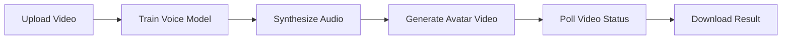

## Overview

Duix Avatar provides a comprehensive set of RESTful APIs that allow you to programmatically train voice models, synthesize audio, and generate avatar videos. After starting the Docker services, these APIs are accessible locally through `http://127.0.0.1`.

## Available Services

The Duix Avatar API consists of three main services running on different ports:

<CardGroup cols={3}>
  <Card title="TTS Service" icon="microphone" href="/api/audio-synthesis">
    Voice training and audio synthesis
    
    **Port:** 18180
  </Card>
  
  <Card title="Video Service" icon="video" href="/api/video-synthesis">
    Avatar video generation
    
    **Port:** 8383
  </Card>
  
  <Card title="ASR Service" icon="waveform" href="/api/model-training">
    Automatic speech recognition
    
    **Port:** 10095
  </Card>
</CardGroup>

## API Workflow

The typical workflow for creating an avatar video involves three steps:

1. **Model Training** - Upload a video file to extract and train a voice model
2. **Audio Synthesis** - Generate audio from text using the trained voice model
3. **Video Synthesis** - Create a lip-synced avatar video using the audio and source video



## Base URLs

All API endpoints use the following base URLs when running locally:

| Service | Base URL | Description |
|---------|----------|-------------|
| TTS (Text-to-Speech) | `http://127.0.0.1:18180` | Voice training and audio synthesis |
| Face2Face | `http://127.0.0.1:8383/easy` | Video synthesis and status queries |
| ASR (Automatic Speech Recognition) | Integrated in TTS service | Audio preprocessing |

<Note>
  In development mode, the services use different IP addresses (192.168.4.204) for testing. Production deployments use localhost (127.0.0.1).
</Note>

## Data Storage

The APIs interact with local file system paths for storing models, audio, and video data:

**Windows:**
- Model videos: `D:\duix_avatar_data\face2face\temp`
- Voice data: `D:\duix_avatar_data\voice\data`
- Training audio: `D:\duix_avatar_data\voice\data\origin_audio`

**Linux/Mac:**
- Model videos: `~/duix_avatar_data/face2face/temp`
- Voice data: `~/duix_avatar_data/voice/data`
- Training audio: `~/duix_avatar_data/voice/data/origin_audio`

## Response Format

All APIs return JSON responses with the following structure:

```json
{
  "code": 0,
  "msg": "Success",
  "data": {
    // Response data varies by endpoint
  }
}
```

### Status Codes

| Code | Description |
|------|-------------|
| 0 | Success |
| 9999 | General error |
| 10000 | Request accepted |
| 10002 | Processing error |
| 10003 | Invalid parameters |

## Prerequisites

Before using the APIs, ensure:

1. **Docker Services Running** - All three Docker containers must be running:
   - `guiji2025/fun-asr` (ASR service)
   - `guiji2025/fish-speech-ziming` (TTS service)
   - `guiji2025/duix.avatar` (Face2Face service)

2. **NVIDIA GPU** - The services require an NVIDIA GPU with proper drivers installed

3. **File Permissions** - Ensure the application has read/write access to the data directories

## Getting Help

For implementation examples and detailed code references, see:

- `src/main/service/model.js` - Model training implementation
- `src/main/service/voice.js` - Audio synthesis implementation
- `src/main/service/video.js` - Video synthesis implementation
- `src/main/api/tts.js` - TTS API client
- `src/main/api/f2f.js` - Face2Face API client

<Info>
  All APIs are designed for local, offline use. No internet connection is required once the Docker images are downloaded and running.
</Info>

## Next Steps

<CardGroup cols={2}>
  <Card title="Model Training" icon="graduation-cap" href="/api/model-training">
    Learn how to train voice models from video files
  </Card>
  
  <Card title="Audio Synthesis" icon="music" href="/api/audio-synthesis">
    Generate audio from text using trained voices
  </Card>
  
  <Card title="Video Synthesis" icon="film" href="/api/video-synthesis">
    Create lip-synced avatar videos
  </Card>
  
  <Card title="Authentication" icon="key" href="/api/authentication">
    API authentication and security
  </Card>
</CardGroup>