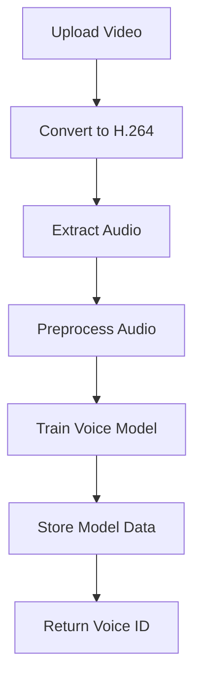

## Overview

The model training API allows you to create custom voice models by extracting audio from video files and training them using the Fish Speech TTS service. This process clones the voice characteristics from your video for later use in audio synthesis.

## Training Workflow

The training process involves several automated steps:

1. **Video Processing** - Convert video to H.264 format
2. **Audio Extraction** - Separate audio track from video using FFmpeg
3. **Audio Preprocessing** - Format audio for training (ASR)
4. **Voice Training** - Create voice model with reference text
5. **Model Storage** - Save model information in database



## Audio Preprocessing & Training

### Endpoint

```
POST http://127.0.0.1:18180/v1/preprocess_and_tran
```

### Request Parameters

<ParamField path="format" type="string" required>
  Audio file format (e.g., "wav", "mp3")
  
  Extracted from the file extension of the source audio.
</ParamField>

<ParamField path="reference_audio" type="string" required>
  Relative path to the audio file for training
  
  Path must be relative to the TTS data directory:
  - Windows: `D:\duix_avatar_data\voice\data`
  - Linux/Mac: `~/duix_avatar_data/voice/data`
  
  Example: `origin_audio/20240315123045678.wav`
</ParamField>

<ParamField path="lang" type="string" default="zh">
  Language code for the audio content
  
  Supported languages:
  - `zh` - Chinese
  - `en` - English
  - `ja` - Japanese
  - `ko` - Korean
  - `fr` - French
  - `de` - German
  - `ar` - Arabic
  - `es` - Spanish
</ParamField>

### Request Example

<CodeGroup>

```javascript Node.js
import fetch from 'node-fetch'

const trainVoiceModel = async (audioPath, language = 'zh') => {
  // Normalize path separators
  audioPath = audioPath.replace(/\\/g, '/')
  
  const params = {
    format: audioPath.split('.').pop(),
    reference_audio: audioPath,
    lang: language
  }
  
  const response = await fetch('http://127.0.0.1:18180/v1/preprocess_and_tran', {
    method: 'POST',
    headers: { 'Content-Type': 'application/json' },
    body: JSON.stringify(params)
  })
  
  return await response.json()
}

// Usage
const result = await trainVoiceModel('origin_audio/my_voice.wav', 'zh')
console.log('Voice ID:', result.voiceId)
```

```bash cURL
curl -X POST http://127.0.0.1:18180/v1/preprocess_and_tran \
  -H "Content-Type: application/json" \
  -d '{
    "format": "wav",
    "reference_audio": "origin_audio/my_voice.wav",
    "lang": "zh"
  }'
```

```python Python
import requests
import json

def train_voice_model(audio_path, language='zh'):
    # Normalize path separators
    audio_path = audio_path.replace('\\', '/')
    
    params = {
        'format': audio_path.split('.')[-1],
        'reference_audio': audio_path,
        'lang': language
    }
    
    response = requests.post(
        'http://127.0.0.1:18180/v1/preprocess_and_tran',
        headers={'Content-Type': 'application/json'},
        data=json.dumps(params)
    )
    
    return response.json()

# Usage
result = train_voice_model('origin_audio/my_voice.wav', 'zh')
print(f"Voice ID: {result['voiceId']}")
```

</CodeGroup>

### Response Format

<ResponseField name="code" type="integer" required>
  Response status code
  - `0` - Success
  - Non-zero - Error occurred
</ResponseField>

<ResponseField name="asr_format_audio_url" type="string">
  Path to the preprocessed audio file
  
  This value is **required for audio synthesis**. Store it for later use.
</ResponseField>

<ResponseField name="reference_audio_text" type="string">
  Transcribed text from the audio
  
  This value is **required for audio synthesis**. Store it for later use.
</ResponseField>

### Response Example

```json
{
  "code": 0,
  "asr_format_audio_url": "origin_audio/20240315123045678_processed.wav",
  "reference_audio_text": "你好世界，这是一个测试音频"
}
```

<Warning>
  **Important:** Save the `asr_format_audio_url` and `reference_audio_text` values from the response. You will need these parameters for audio synthesis in the next step.
</Warning>

## Complete Training Implementation

### Full Model Training Function

Here's the complete implementation from `src/main/service/voice.js`:

```javascript
import { preprocessAndTran } from '../api/tts.js'
import { insert } from '../dao/voice.js'

export async function train(path, lang = 'zh') {
  // Normalize Windows path separators
  path = path.replace(/\\/g, '/')
  
  // Call preprocessing and training API
  const res = await preprocessAndTran({
    format: path.split('.').pop(),
    reference_audio: path,
    lang
  })
  
  // Check for success
  if (res.code !== 0) {
    return false
  }
  
  // Extract training results
  const { asr_format_audio_url, reference_audio_text } = res
  
  // Store in database and return voice ID
  return insert({
    origin_audio_path: path,
    lang,
    asr_format_audio_url,
    reference_audio_text
  })
}
```

### Complete Video-to-Model Pipeline

Here's the full implementation from `src/main/service/model.js`:

```javascript
import fs from 'fs'
import path from 'path'
import dayjs from 'dayjs'
import { extractAudio, toH264 } from '../util/ffmpeg.js'
import { train as trainVoice } from './voice.js'
import { insert } from '../dao/f2f-model.js'
import { assetPath } from '../config/config.js'

async function addModel(modelName, videoPath) {
  // 1. Create directories if needed
  if (!fs.existsSync(assetPath.model)) {
    fs.mkdirSync(assetPath.model, { recursive: true })
  }
  
  // 2. Convert video to H.264 format
  const extname = path.extname(videoPath)
  const modelFileName = dayjs().format('YYYYMMDDHHmmssSSS') + extname
  const modelPath = path.join(assetPath.model, modelFileName)
  await toH264(videoPath, modelPath)
  
  // 3. Extract audio from video
  if (!fs.existsSync(assetPath.ttsTrain)) {
    fs.mkdirSync(assetPath.ttsTrain, { recursive: true })
  }
  const audioPath = path.join(
    assetPath.ttsTrain,
    modelFileName.replace(extname, '.wav')
  )
  await extractAudio(modelPath, audioPath)
  
  // 4. Train voice model
  const relativeAudioPath = path.relative(assetPath.ttsRoot, audioPath)
  const voiceId = await trainVoice(relativeAudioPath, 'zh')
  
  // 5. Save model information
  const relativeModelPath = path.relative(assetPath.model, modelPath)
  const modelId = insert({
    modelName,
    videoPath: relativeModelPath,
    audioPath: relativeAudioPath,
    voiceId
  })
  
  return modelId
}
```

## File Path Requirements

### Audio File Location

Audio files must be placed in the TTS data directory:

**Windows:**
```
D:\duix_avatar_data\voice\data\origin_audio\your_audio.wav
```

**Linux/Mac:**
```
~/duix_avatar_data/voice/data/origin_audio/your_audio.wav
```

### Path Format

Use relative paths from the TTS root directory:

```javascript
// Correct - relative path
reference_audio: "origin_audio/my_voice.wav"

// Incorrect - absolute path
reference_audio: "D:/duix_avatar_data/voice/data/origin_audio/my_voice.wav"
```

<Note>
  The API expects paths with forward slashes (`/`) even on Windows. The code automatically converts backslashes to forward slashes.
</Note>

## Error Handling

### Common Errors

<Expandable title="File Not Found">
  **Error:** Audio file does not exist
  
  **Solution:** 
  - Verify the file exists in the correct directory
  - Check file permissions
  - Ensure path separators are correct
  
  ```javascript
  import fs from 'fs'
  import path from 'path'
  
  const fullPath = path.join(assetPath.ttsRoot, audioPath)
  if (!fs.existsSync(fullPath)) {
    throw new Error(`Audio file not found: ${fullPath}`)
  }
  ```
</Expandable>

<Expandable title="Invalid Audio Format">
  **Error:** Unsupported audio format
  
  **Solution:**
  - Convert audio to WAV format
  - Ensure audio is mono channel
  - Use appropriate sample rate (16kHz or 44.1kHz)
  
  ```bash
  # Convert to WAV using FFmpeg
  ffmpeg -i input.mp3 -ar 16000 -ac 1 output.wav
  ```
</Expandable>

<Expandable title="Training Failed (code !== 0)">
  **Error:** Training API returned non-zero code
  
  **Solution:**
  - Check Docker service logs
  - Verify GPU is available
  - Ensure sufficient disk space
  - Check audio file quality
</Expandable>

### Error Response Example

```json
{
  "code": 9999,
  "msg": "Failed to process audio file",
  "error": "Audio file is corrupted or invalid format"
}
```

## Best Practices

### 1. Audio Quality

For best training results:

- Use clear, high-quality audio
- Avoid background noise
- Minimum duration: 3-5 seconds
- Recommended: 10-30 seconds of speech
- Sample rate: 16kHz or higher
- Format: WAV (mono channel)

### 2. Language Selection

Choose the correct language code:

```javascript
const languageMap = {
  'Chinese': 'zh',
  'English': 'en',
  'Japanese': 'ja',
  'Korean': 'ko',
  'French': 'fr',
  'German': 'de',
  'Arabic': 'ar',
  'Spanish': 'es'
}

const lang = languageMap[detectedLanguage] || 'zh'
```

### 3. Store Training Results

Always save the training results for later use:

```javascript
const trainingResult = await trainVoice(audioPath, 'zh')

if (trainingResult) {
  const voiceModel = {
    id: trainingResult.voiceId,
    asrAudioUrl: trainingResult.asr_format_audio_url,
    referenceText: trainingResult.reference_audio_text,
    createdAt: new Date()
  }
  
  // Save to database or file
  await saveVoiceModel(voiceModel)
}
```

### 4. Handle Async Operations

The training process is asynchronous and may take time:

```javascript
async function trainWithProgress(audioPath, lang) {
  console.log('Starting voice training...')
  
  try {
    const result = await trainVoice(audioPath, lang)
    
    if (!result) {
      throw new Error('Training failed')
    }
    
    console.log('Training completed successfully!')
    return result
    
  } catch (error) {
    console.error('Training error:', error.message)
    throw error
  }
}
```

## Next Steps

After training a voice model, you can:

<CardGroup cols={2}>
  <Card title="Audio Synthesis" icon="music" href="/api/audio-synthesis">
    Generate audio using your trained voice model
  </Card>
  
  <Card title="Video Synthesis" icon="film" href="/api/video-synthesis">
    Create lip-synced avatar videos
  </Card>
</CardGroup>