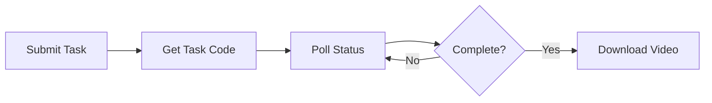

## Overview

The video synthesis API creates realistic lip-synced avatar videos by combining audio with a source video. It uses the Face2Face (F2F) service to match lip movements to the audio track, creating natural-looking digital human videos.

## Video Synthesis Workflow

The process involves submitting a synthesis task and polling for completion:



## Submit Video Synthesis

### Endpoint

```
POST http://127.0.0.1:8383/easy/submit
```

### Request Parameters

<ParamField path="audio_url" type="string" required>
  Relative path to the audio file
  
  Path relative to the Face2Face data directory. This is typically the filename returned from audio synthesis.
  
  Example: `550e8400-e29b-41d4-a716-446655440000.wav`
</ParamField>

<ParamField path="video_url" type="string" required>
  Relative path to the source video file
  
  Path relative to the model directory. This is the video that contains the avatar/person to animate.
  
  Example: `20240315123045678.mp4`
</ParamField>

<ParamField path="code" type="string" required>
  Unique task identifier
  
  Generate using `crypto.randomUUID()`. This code is used to query the task status later.
</ParamField>

<ParamField path="chaofen" type="integer" default="0">
  Super-resolution flag
  
  Fixed parameter. Set to `0` (disabled) or `1` (enabled).
</ParamField>

<ParamField path="watermark_switch" type="integer" default="0">
  Watermark flag
  
  Fixed parameter. Set to `0` (no watermark) or `1` (add watermark).
</ParamField>

<ParamField path="pn" type="integer" default="1">
  Processing node identifier
  
  Fixed parameter. Always set to `1`.
</ParamField>

### Request Example

<CodeGroup>

```javascript Node.js
import crypto from 'crypto'
import fetch from 'node-fetch'

const submitVideoSynthesis = async (audioPath, videoPath) => {
  const taskCode = crypto.randomUUID()
  
  const params = {
    audio_url: audioPath,
    video_url: videoPath,
    code: taskCode,
    chaofen: 0,
    watermark_switch: 0,
    pn: 1
  }
  
  const response = await fetch('http://127.0.0.1:8383/easy/submit', {
    method: 'POST',
    headers: { 'Content-Type': 'application/json' },
    body: JSON.stringify(params)
  })
  
  const result = await response.json()
  return { taskCode, result }
}

// Usage
const { taskCode, result } = await submitVideoSynthesis(
  '550e8400-e29b-41d4-a716-446655440000.wav',
  '20240315123045678.mp4'
)

console.log(`Task submitted with code: ${taskCode}`)
console.log(`Status: ${result.msg}`)
```

```bash cURL
curl -X POST http://127.0.0.1:8383/easy/submit \
  -H "Content-Type: application/json" \
  -d '{
    "audio_url": "550e8400-e29b-41d4-a716-446655440000.wav",
    "video_url": "20240315123045678.mp4",
    "code": "abc123-def456-ghi789",
    "chaofen": 0,
    "watermark_switch": 0,
    "pn": 1
  }'
```

```python Python
import uuid
import requests
import json

def submit_video_synthesis(audio_path, video_path):
    task_code = str(uuid.uuid4())
    
    params = {
        'audio_url': audio_path,
        'video_url': video_path,
        'code': task_code,
        'chaofen': 0,
        'watermark_switch': 0,
        'pn': 1
    }
    
    response = requests.post(
        'http://127.0.0.1:8383/easy/submit',
        headers={'Content-Type': 'application/json'},
        data=json.dumps(params)
    )
    
    result = response.json()
    return {'task_code': task_code, 'result': result}

# Usage
response = submit_video_synthesis(
    '550e8400-e29b-41d4-a716-446655440000.wav',
    '20240315123045678.mp4'
)

print(f"Task code: {response['task_code']}")
print(f"Status: {response['result']['msg']}")
```

</CodeGroup>

### Response Format

<ResponseField name="code" type="integer" required>
  Response status code
  
  - `10000` - Success, task accepted
  - `9999` - General error
  - `10002` - Processing error
  - `10003` - Invalid parameters
</ResponseField>

<ResponseField name="msg" type="string">
  Status message describing the result
</ResponseField>

### Response Example

```json
{
  "code": 10000,
  "msg": "Task submitted successfully"
}
```

<Warning>
  **Important:** Save the `code` parameter you sent in the request. You'll need it to query the task status.
</Warning>

## Query Video Status

### Endpoint

```
GET http://127.0.0.1:8383/easy/query?code={taskCode}
```

### Request Parameters

<ParamField query="code" type="string" required>
  The task code from the submit request
  
  This is the UUID you generated when submitting the synthesis task.
</ParamField>

### Request Example

<CodeGroup>

```javascript Node.js
const queryVideoStatus = async (taskCode) => {
  const response = await fetch(
    `http://127.0.0.1:8383/easy/query?code=${taskCode}`
  )
  return await response.json()
}

// Usage
const status = await queryVideoStatus(taskCode)
console.log(`Progress: ${status.data.progress}%`)
console.log(`Status: ${status.data.msg}`)
```

```bash cURL
curl -X GET "http://127.0.0.1:8383/easy/query?code=abc123-def456-ghi789"
```

```python Python
import requests

def query_video_status(task_code):
    response = requests.get(
        f'http://127.0.0.1:8383/easy/query?code={task_code}'
    )
    return response.json()

# Usage
status = query_video_status(task_code)
print(f"Progress: {status['data']['progress']}%")
print(f"Status: {status['data']['msg']}")
```

</CodeGroup>

### Response Format

<ResponseField name="code" type="integer" required>
  API response code
  
  - `10000` - Success
  - `9999` - General error
  - `10002` - Processing error
  - `10003` - Task not found
</ResponseField>

<ResponseField name="msg" type="string">
  Response message
</ResponseField>

<ResponseField name="data" type="object">
  Task status information
  
  <Expandable title="data object properties">
    <ResponseField name="status" type="integer">
      Processing status:
      - `1` - In progress
      - `2` - Completed successfully
      - `3` - Failed
    </ResponseField>
    
    <ResponseField name="progress" type="integer">
      Completion percentage (0-100)
    </ResponseField>
    
    <ResponseField name="msg" type="string">
      Status message
    </ResponseField>
    
    <ResponseField name="result" type="string">
      Relative path to the generated video file (only present when status is 2)
      
      Example: `result/abc123-def456-ghi789.mp4`
    </ResponseField>
  </Expandable>
</ResponseField>

### Response Examples

**In Progress:**
```json
{
  "code": 10000,
  "msg": "Success",
  "data": {
    "status": 1,
    "progress": 45,
    "msg": "Processing video..."
  }
}
```

**Completed:**
```json
{
  "code": 10000,
  "msg": "Success",
  "data": {
    "status": 2,
    "progress": 100,
    "msg": "Video synthesis completed",
    "result": "result/550e8400-e29b-41d4-a716-446655440000.mp4"
  }
}
```

**Failed:**
```json
{
  "code": 10000,
  "msg": "Success",
  "data": {
    "status": 3,
    "progress": 0,
    "msg": "Video synthesis failed: Invalid audio format"
  }
}
```

## Complete Implementation

### Video Synthesis Function

From `src/main/service/video.js`:

```javascript
import crypto from 'crypto'
import { makeVideo as makeVideoApi } from '../api/f2f.js'
import { selectByID as selectF2FModelByID } from '../dao/f2f-model.js'
import { selectByID as selectVoiceByID } from '../dao/voice.js'
import { update, selectByID as selectVideoByID } from '../dao/video.js'
import { makeAudio4Video } from './voice.js'

export async function synthesisVideo(videoId) {
  try {
    update({
      id: videoId,
      file_path: null,
      status: 'pending',
      message: 'Submitting task',
    })

    // Get video record
    const video = selectVideoByID(videoId)

    // Get model information
    const model = selectF2FModelByID(video.model_id)

    let audioPath
    if (video.audio_path) {
      // Use existing audio
      audioPath = video.audio_path
    } else {
      // Generate audio from text
      const voice = selectVoiceByID(video.voice_id || model.voice_id)
      audioPath = await makeAudio4Video({
        voiceId: voice.id,
        text: video.text_content
      })
    }

    // Submit video synthesis
    const { result, param } = await makeVideoByF2F(
      audioPath,
      model.video_path
    )

    if (result.code === 10000) {
      update({
        id: videoId,
        status: 'pending',
        message: result.msg,
        audio_path: audioPath,
        param,
        code: param.code
      })
    } else {
      update({
        id: videoId,
        status: 'failed',
        message: result.msg,
        audio_path: audioPath,
        param,
        code: param.code
      })
    }
  } catch (error) {
    console.error('Synthesis error:', error)
    update(videoId, 'failed', error.message)
  }

  return videoId
}

async function makeVideoByF2F(audioPath, videoPath) {
  const uuid = crypto.randomUUID()
  const param = {
    audio_url: audioPath,
    video_url: videoPath,
    code: uuid,
    chaofen: 0,
    watermark_switch: 0,
    pn: 1
  }
  const result = await makeVideoApi(param)
  return { param, result }
}
```

### Status Polling Loop

From `src/main/service/video.js`:

```javascript
import { getVideoStatus } from '../api/f2f.js'
import { findFirstByStatus, updateStatus, update } from '../dao/video.js'
import { getVideoDuration } from '../util/ffmpeg.js'
import path from 'path'
import { assetPath } from '../config/config.js'

export async function loopPending() {
  const video = findFirstByStatus('pending')
  
  if (!video) {
    setTimeout(() => loopPending(), 2000)
    return
  }

  const statusRes = await getVideoStatus(video.code)

  if ([9999, 10002, 10003].includes(statusRes.code)) {
    // Error codes
    updateStatus(video.id, 'failed', statusRes.msg)
  } else if (statusRes.code === 10000) {
    if (statusRes.data.status === 1) {
      // In progress
      updateStatus(
        video.id,
        'pending',
        statusRes.data.msg,
        statusRes.data.progress
      )
    } else if (statusRes.data.status === 2) {
      // Completed successfully
      const resultPath = path.join(assetPath.model, statusRes.data.result)
      const duration = await getVideoDuration(resultPath)

      update({
        id: video.id,
        status: 'success',
        message: statusRes.data.msg,
        progress: statusRes.data.progress,
        file_path: statusRes.data.result,
        duration
      })
    } else if (statusRes.data.status === 3) {
      // Failed
      updateStatus(video.id, 'failed', statusRes.data.msg)
    }
  }

  setTimeout(() => loopPending(), 2000)
}
```

## Complete Workflow Example

### End-to-End Video Generation

```javascript
import crypto from 'crypto'
import fs from 'fs'
import path from 'path'

// Complete workflow from text to video
async function generateAvatarVideo({
  modelId,
  text,
  voiceId,
  outputDir = './output'
}) {
  try {
    // Step 1: Get model information
    const model = selectF2FModelByID(modelId)
    console.log('Using model:', model.modelName)
    
    // Step 2: Generate audio from text
    console.log('Generating audio...')
    const audioFileName = await makeAudio4Video({
      voiceId,
      text
    })
    console.log(`Audio created: ${audioFileName}`)
    
    // Step 3: Submit video synthesis
    console.log('Submitting video synthesis...')
    const taskCode = crypto.randomUUID()
    const params = {
      audio_url: audioFileName,
      video_url: model.video_path,
      code: taskCode,
      chaofen: 0,
      watermark_switch: 0,
      pn: 1
    }
    
    const submitResult = await makeVideoApi(params)
    if (submitResult.code !== 10000) {
      throw new Error(`Failed to submit: ${submitResult.msg}`)
    }
    
    console.log(`Task submitted: ${taskCode}`)
    
    // Step 4: Poll for completion
    console.log('Waiting for video synthesis...')
    const videoPath = await pollUntilComplete(taskCode)
    
    // Step 5: Copy to output directory
    const outputPath = path.join(outputDir, `${taskCode}.mp4`)
    fs.copyFileSync(
      path.join(assetPath.model, videoPath),
      outputPath
    )
    
    console.log(`Video saved to: ${outputPath}`)
    return outputPath
    
  } catch (error) {
    console.error('Error generating video:', error)
    throw error
  }
}

async function pollUntilComplete(taskCode, maxAttempts = 300) {
  for (let i = 0; i < maxAttempts; i++) {
    const status = await getVideoStatus(taskCode)
    
    if (status.code !== 10000) {
      throw new Error(`Status check failed: ${status.msg}`)
    }
    
    const { data } = status
    
    if (data.status === 2) {
      // Success
      console.log('Video synthesis complete!')
      return data.result
    } else if (data.status === 3) {
      // Failed
      throw new Error(`Synthesis failed: ${data.msg}`)
    } else {
      // In progress
      console.log(`Progress: ${data.progress}% - ${data.msg}`)
      await new Promise(resolve => setTimeout(resolve, 2000))
    }
  }
  
  throw new Error('Timeout waiting for video synthesis')
}

// Usage
const videoPath = await generateAvatarVideo({
  modelId: 1,
  text: 'Hello world, this is my AI avatar speaking.',
  voiceId: 5,
  outputDir: './my_videos'
})
```

## Error Handling

### Common Errors

<Expandable title="Task Not Found">
  **Error:** `code: 10003` - Task code not found
  
  **Solution:**
  - Verify you're using the correct task code
  - Task may have expired (check service retention policy)
  - Service may have restarted (losing task queue)
</Expandable>

<Expandable title="File Not Found">
  **Error:** Audio or video file not found
  
  **Solution:**
  ```javascript
  // Verify files exist before submitting
  const audioFullPath = path.join(assetPath.ttsProduct, audioPath)
  const videoFullPath = path.join(assetPath.model, videoPath)
  
  if (!fs.existsSync(audioFullPath)) {
    throw new Error(`Audio not found: ${audioFullPath}`)
  }
  if (!fs.existsSync(videoFullPath)) {
    throw new Error(`Video not found: ${videoFullPath}`)
  }
  ```
</Expandable>

<Expandable title="Processing Failed (status 3)">
  **Error:** Video synthesis failed during processing
  
  **Common causes:**
  - Audio and video duration mismatch
  - Corrupted audio or video files
  - Insufficient GPU memory
  - Invalid video format
  
  **Solution:**
  - Check service logs: `docker logs duix.avatar`
  - Verify video is in H.264 format
  - Ensure audio is valid WAV format
  - Check GPU availability and memory
</Expandable>

## Best Practices

### 1. Implement Robust Polling

```javascript
async function pollWithBackoff(taskCode, options = {}) {
  const {
    initialDelay = 2000,
    maxDelay = 10000,
    maxAttempts = 300,
    backoffMultiplier = 1.5
  } = options
  
  let delay = initialDelay
  
  for (let attempt = 0; attempt < maxAttempts; attempt++) {
    const status = await getVideoStatus(taskCode)
    
    if (status.data.status === 2) {
      return status.data.result
    } else if (status.data.status === 3) {
      throw new Error(status.data.msg)
    }
    
    await new Promise(resolve => setTimeout(resolve, delay))
    delay = Math.min(delay * backoffMultiplier, maxDelay)
  }
  
  throw new Error('Polling timeout')
}
```

### 2. Validate Input Files

```javascript
function validateVideoInputs(audioPath, videoPath) {
  const audioFullPath = path.join(assetPath.ttsProduct, audioPath)
  const videoFullPath = path.join(assetPath.model, videoPath)
  
  if (!fs.existsSync(audioFullPath)) {
    throw new Error(`Audio file not found: ${audioFullPath}`)
  }
  
  if (!fs.existsSync(videoFullPath)) {
    throw new Error(`Video file not found: ${videoFullPath}`)
  }
  
  // Check file sizes
  const audioStats = fs.statSync(audioFullPath)
  const videoStats = fs.statSync(videoFullPath)
  
  if (audioStats.size === 0) {
    throw new Error('Audio file is empty')
  }
  
  if (videoStats.size === 0) {
    throw new Error('Video file is empty')
  }
  
  return true
}
```

### 3. Queue Management

Manage multiple video synthesis tasks:

```javascript
class VideoSynthesisQueue {
  constructor() {
    this.queue = []
    this.processing = false
  }
  
  async add(audioPath, videoPath) {
    const task = { audioPath, videoPath, code: crypto.randomUUID() }
    this.queue.push(task)
    
    if (!this.processing) {
      this.processNext()
    }
    
    return task.code
  }
  
  async processNext() {
    if (this.queue.length === 0) {
      this.processing = false
      return
    }
    
    this.processing = true
    const task = this.queue.shift()
    
    try {
      await this.synthesizeVideo(task)
    } catch (error) {
      console.error('Task failed:', error)
    }
    
    this.processNext()
  }
  
  async synthesizeVideo(task) {
    // Submit and poll...
  }
}
```

### 4. Progress Callbacks

```javascript
async function synthesizeWithProgress(taskCode, onProgress) {
  while (true) {
    const status = await getVideoStatus(taskCode)
    
    if (status.data.status === 2) {
      onProgress(100, 'Complete', status.data.result)
      return status.data.result
    } else if (status.data.status === 3) {
      throw new Error(status.data.msg)
    }
    
    onProgress(
      status.data.progress,
      status.data.msg
    )
    
    await new Promise(resolve => setTimeout(resolve, 2000))
  }
}

// Usage
await synthesizeWithProgress(taskCode, (progress, message, result) => {
  console.log(`${progress}%: ${message}`)
  if (result) {
    console.log(`Result: ${result}`)
  }
})
```

## Next Steps

<CardGroup cols={3}>
  <Card title="Model Training" icon="graduation-cap" href="/api/model-training">
    Train voice models from video files
  </Card>
  
  <Card title="Audio Synthesis" icon="music" href="/api/audio-synthesis">
    Generate audio from text
  </Card>
  
  <Card title="API Introduction" icon="book" href="/api/introduction">
    Return to API overview
  </Card>
</CardGroup>